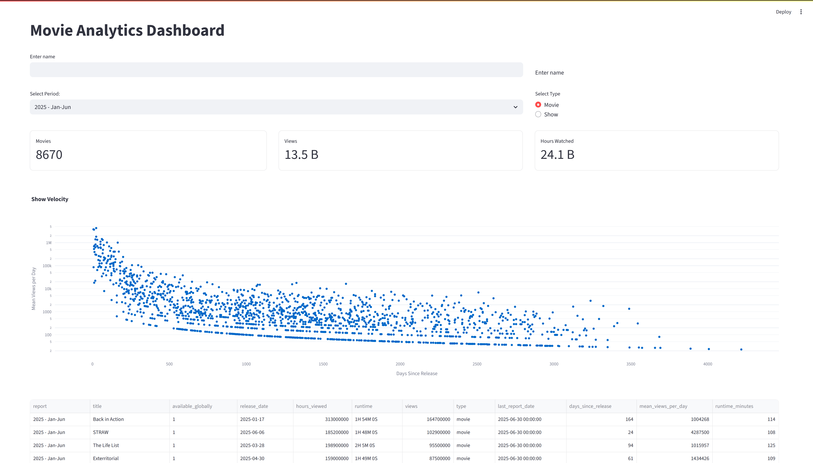

# Trying out all Python Data Web Frameworks



```sh
# Build .venv environment
uv sync

# Download data
cd data
uv run pydytuesday tt-download 2025-07-29

# Run apps
uv run streamlit run streamlit/streamlit_app.py
uv run gradio gradio/gradio_app.py
uv run shiny run --reload -h 0.0.0.0 shiny/app.py
uv run panel serve --dev panel/panel_app.py
uv run nicegui/nicegui_app.py
uv run solara run solara/sol.py

cd reflex-app
uv run reflex run
```

Inspiration: <https://stevenponce.netlify.app/data_visualizations/TidyTuesday/2025/tt_2025_30.html>